DeepSearch is a knowledge-augmented, high-performance deep retrieval and research engine. It uses structured knowledge and LLMs with tools to deliver enterprise Agentic AI search and research. This document walks through using the DeepResearch agent for report-oriented research and the DeepSearch agent for complex question answering.

## 1. Preparation

> **Note**: The product has separate front-end and back-end projects. Before you start, ensure both are deployed and running. If not, follow the [DeepSearch Full Edition installation guide](../2.Installation%20Guide/DeepSearch%20Full%20Edition/README.md).

### 1. Get an LLM API key

DeepSearch needs an LLM. Purchase or host a model from a provider. The steps below use Huawei Cloud as an example.

* Open the [ModelArts deployment console](https://console.huaweicloud.com/modelarts/?locale=zh-cn&region=cn-southwest-2#/model-studio/deployment) (online inference).

* Pick a model and click **Enable service**.

  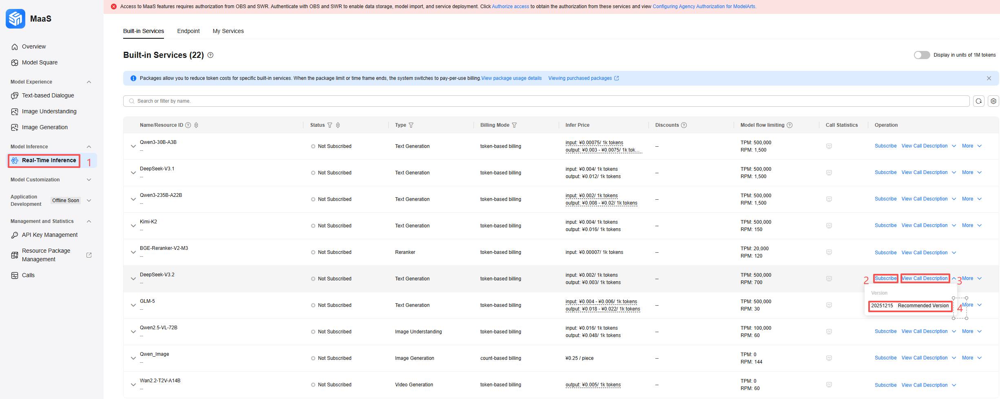

* After enabling, open **Invocation guide** for model details.

  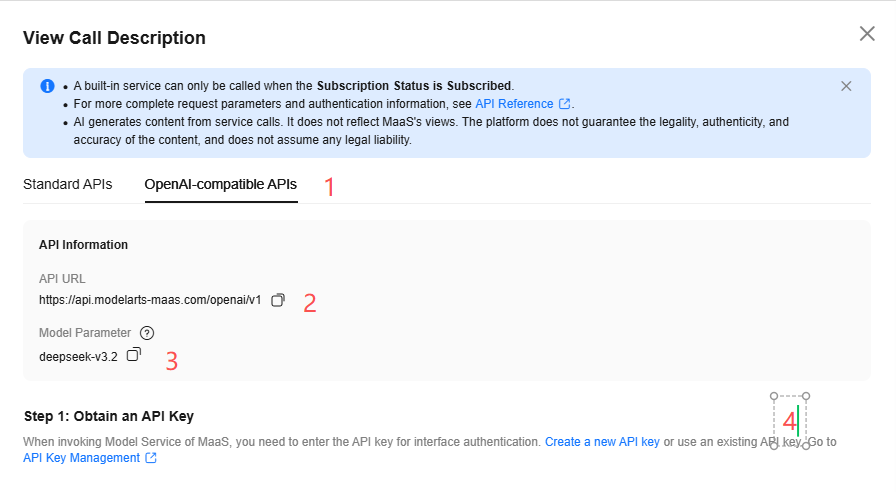

* Open **OpenAI-compatible API** and note the *API endpoint* and *model* parameter.

* Under **API key management**, create a key per the console.

> Details: [Huawei Cloud ModelArts MaaS user guide](https://support.huaweicloud.com/usermanual-maas-modelarts/maas-modelarts-0195.html)

---
### 2. Get a web search / augmentation API key

DeepResearch uses a web augmentation service (e.g. [Tavily](https://www.tavily.com/)) to fetch online information.

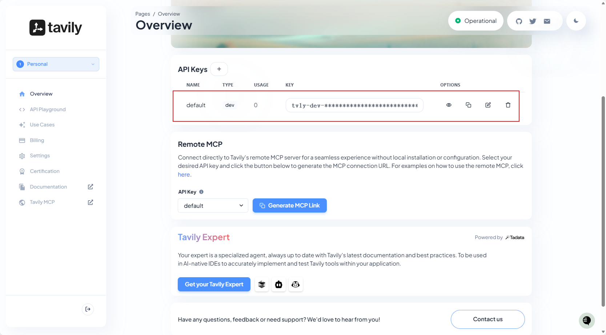

> Tavily: [official documentation](https://docs.tavily.com/documentation/about)

---
### 3. Model configuration

In **Model management**, three model types are supported:
1. **LLM**: Large language model — text in, text out.
2. **Embedding**: Text-to-vector embedding model.
3. **VLM**: Vision-language model — image in, image out.

Select a model type, then click **Add model**. Fill in **Model name**, **Model ID**, **API key**, **Base URL**, and **Description**.

* **Model name**: Display name; you choose.
* **Model ID**: Provider's model id (matches Huawei *model* parameter).
* **API key**: From the provider (Huawei *API Key*).
* **Base URL**: Provider API base URL (Huawei *API address*).
* **Description**: Optional notes.

  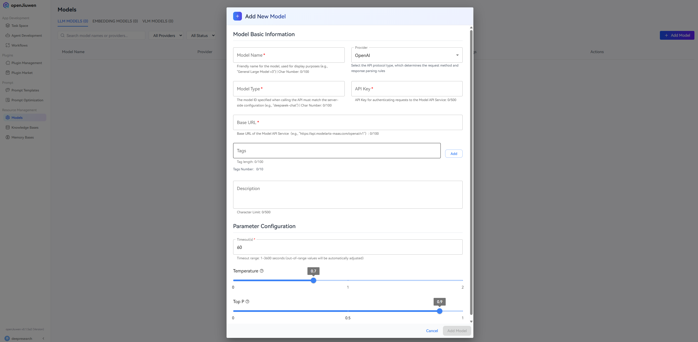

Test the model:

* In model management, click **Test** on a model.
* Pick a sample prompt.
* Click start; **Test succeeded** means configuration is OK.

  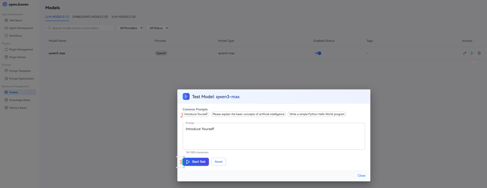

> If testing fails, double-check endpoint, model id, and key.

---
## 2. Using the DeepResearch Agent

### 1. Prerequisites

Open **Task space** to reach the agent chat UI.

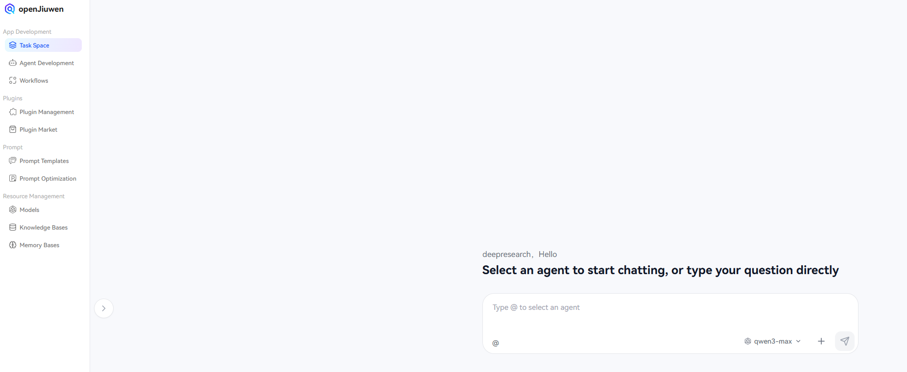

Before using DeepResearch, complete the following.

---
#### Select the DeepResearch agent

In the input box type `@DeepResearch` to pick the agent.

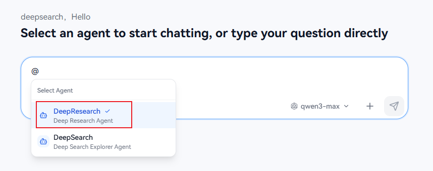

The first time (or if setup is incomplete), a configuration dialog appears—use [Agent configuration](#agent-configuration) below, then **Save configuration**.

> After saving, the DeepResearch agent is active.

---
#### Agent configuration

Click **Configure** next to the DeepResearch agent.

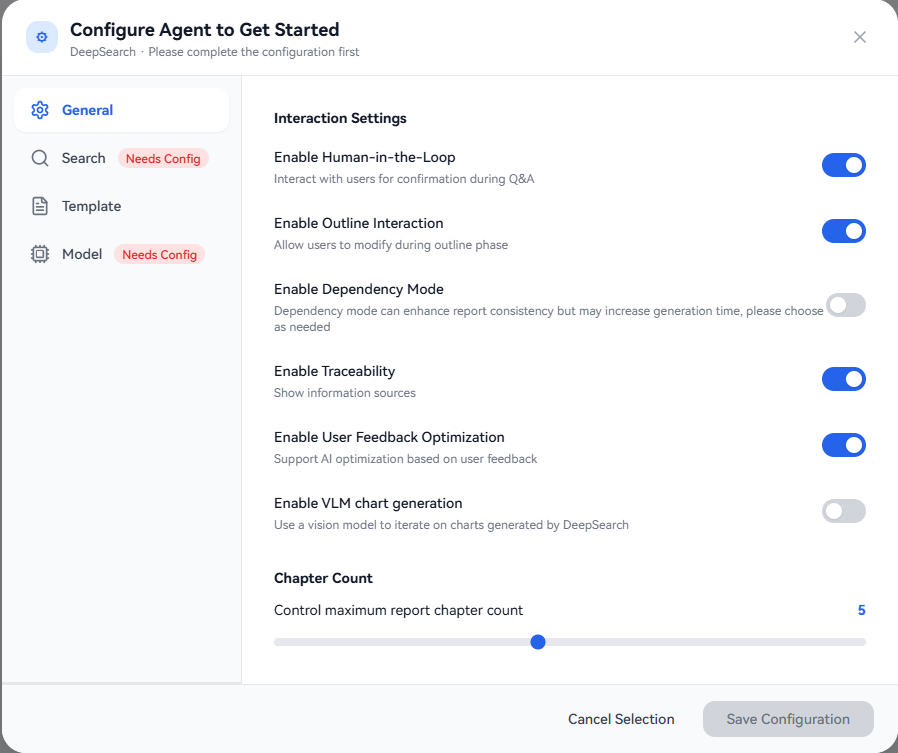

Three tabs group the settings.

> Click **Save configuration** when done.

#### General

General settings cover interaction and planning options.

* **Enable Q&A interaction**: When on, the agent asks clarifying questions before planning the task.
* **Enable outline interaction**: When on, users can review and revise the report outline over multiple rounds before research begins.
* **Enable dependency model**: When off, sections are generated in parallel. When on, sections are serialized with dependencies. Dependency mode improves report consistency but increases generation time — enable as needed.
* **Enable provenance**: When on, results show information sources.
* **Enable user feedback optimization**: When on, after a report is generated you can select text passages and apply AI rewriting (expand, polish, condense, or supplemental search).
* **Enable VLM chart generation**: When on, the vision model iteratively refines generated charts. This increases report generation time — enable as needed.
  * **VLM model**: A VLM model must first be configured in **Model management**, otherwise this option cannot be enabled.
  * **Max iterations**: Controls how many times the VLM refines each chart (1–3). Higher values produce more detailed charts but take longer.
* **Number of sections**: Max report sections (1–15); higher values mean more detailed planning.

#### Search

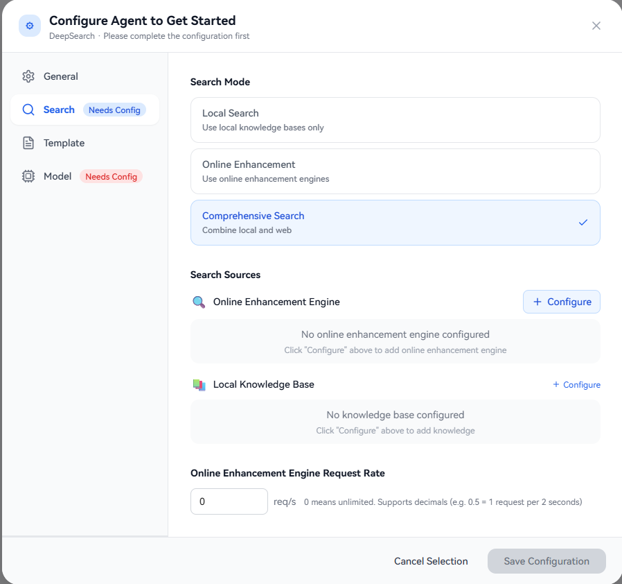

Search settings cover search mode, search sources, and request rate control.

**Search mode**: Choose how to search.
- **Local search**: Knowledge base only.
- **Web augmentation**: Use a web augmentation engine.
- **Hybrid search**: Combine local and web search.

> The selected search mode determines which search sources are configurable below.

**Search sources**: Configure sources based on the selected mode.

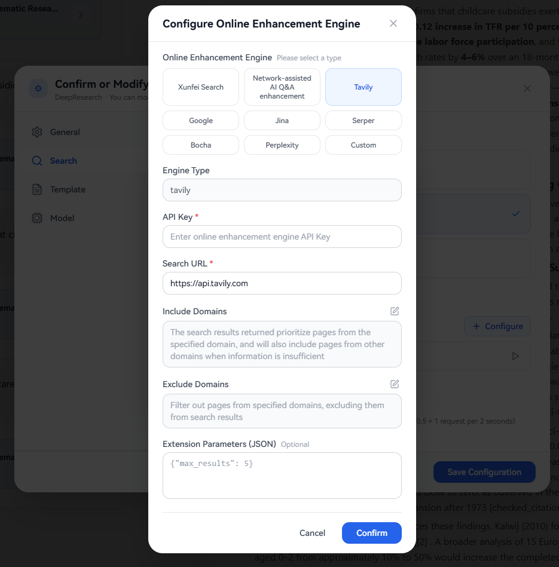

- **Web augmentation engine**: Click **Configure** to add engines. Supports iFlytek Search, Petal AI Q&A, Tavily (supports targeted source retrieval), Google, Jina, Bocha, Perplexity, Serper, and custom engines (as shown above).
- **Local knowledge base**: Click **Configure** to select one or more knowledge bases.

  Knowledge base status:
  - **Available (green)**: Ready to use.
  - **Processing (gray)**: Still being indexed; not yet available.
  - **Failed (red)**: Processing failed; cannot be used.

  > Only knowledge bases in **Available** status are queried during research. Create and sync knowledge bases in the Knowledge Base management page before use.

**Request rate control**: Limit how fast requests are sent to the web augmentation engine.
- QPS: requests per second; default 0 means unlimited.
- Decimal values are supported — e.g. 0.5 means 1 request every 2 seconds.

  > Setting a reasonable QPS prevents hitting engine rate limits and controls resource usage.

#### Templates (optional)

To control report structure, use templates.

* **Available templates**: Pick from the list; the agent formats the report accordingly.
* **Import template**: **Upload new template** from a sample.
  * **Extract**: Auto-extract structure from Markdown, HTML, Word, or PDF.
     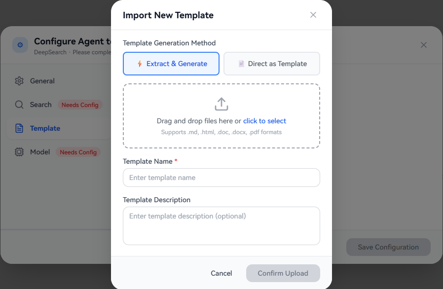
  * **Use as template**: Use a Markdown file directly as the template.
     

> Templates are optional.
> Uploaded templates or sample reports must be no larger than `50 MB` per file. Very large or structurally complex documents may fail to parse, so splitting the file and retrying is recommended.

#### Model assignment

Assign models per research stage for quality vs cost.

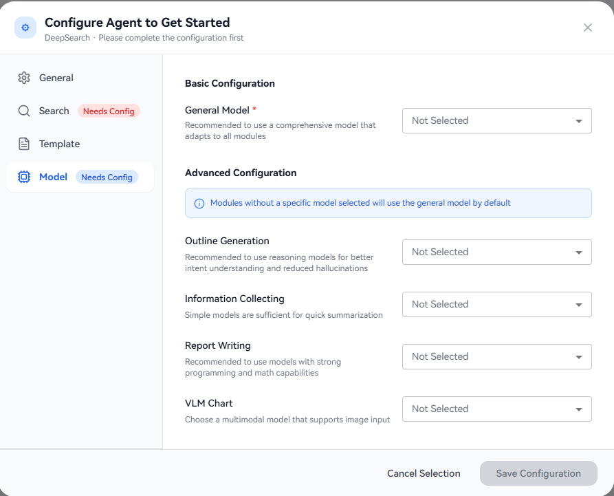

**Basic**

- **General model** (required): Default for all stages when advanced slots are empty. Prefer a strong general model.

**Advanced** (optional)

Per-stage overrides; unset stages use the general model.

- **Outline generation**: Prefer a strong reasoning model to accurately understand intent and reduce hallucinations.
- **Information gathering**: Lightweight model is often enough for quick summarization.
- **Report writing**: Prefer models strong at code/math for accuracy and professionalism.

> Advanced is optional. All configured models must support **function calling** so the agent can invoke tools correctly.

---
#### Choose the chat model

Use the model picker in the top-right of the chat.

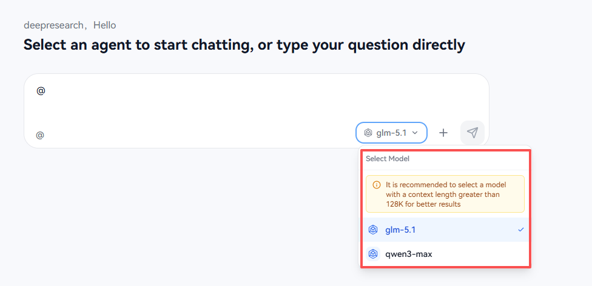

> You must select a model. Context under 128K may limit long research reports.

---
### 2. Conversation flow

#### 2.1 Ask a question

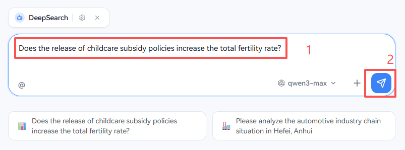

> **Notes**  
> - Type in area **1**, send with **2**.  
> - Two modes: HITL (human-in-the-loop) and non-HITL.

##### 2.1.1 HITL mode

In HITL mode, if the relevant interaction options are enabled, multiple rounds of interaction occur:

**User intent interaction** (enable Q&A interaction in General settings):

1. You ask; DeepSearch/DeepResearch may ask follow-ups.
   - Yellow indicator (**1**) = waiting for your reply.
   - Type feedback in **2** and send.  
    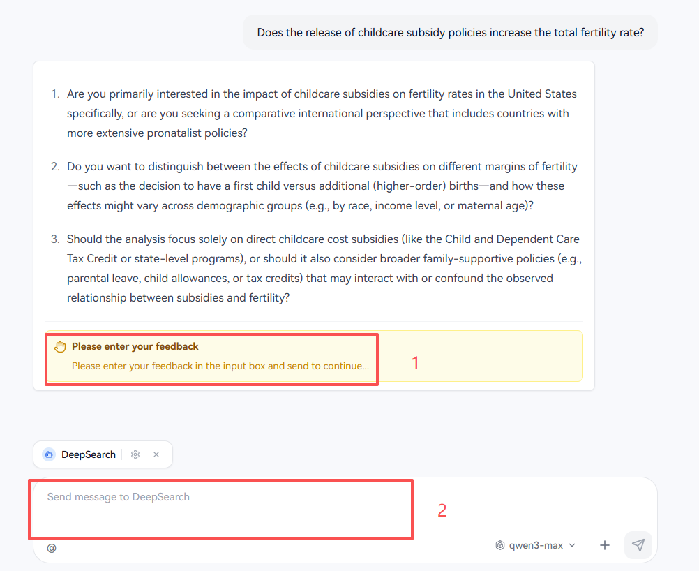
2. After your reply, report outline generation continues.
   - Green (**3**) = feedback received.
   - **4** shows your message; **5** shows outline generation starting.  
    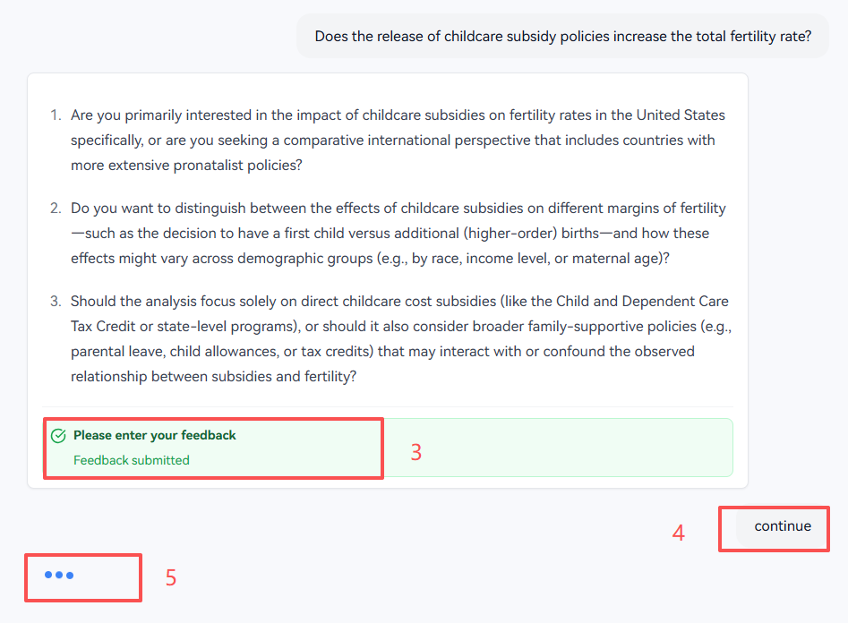

**Outline interaction** (enable outline interaction in General settings):

1. **Outline review**: After the outline is generated, execution pauses and waits for your confirmation or edits.
    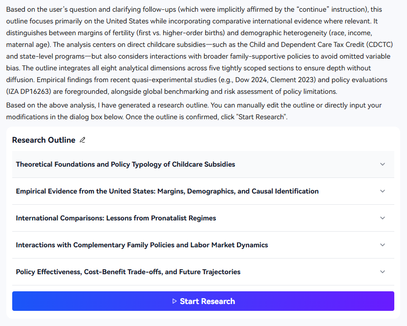
2. **Outline editing**: Click **Start research** to accept the outline, or refine it first. Two editing methods are available:
   - **Refine via feedback**: Submit revision comments in the chat; the system regenerates the outline based on your input.
      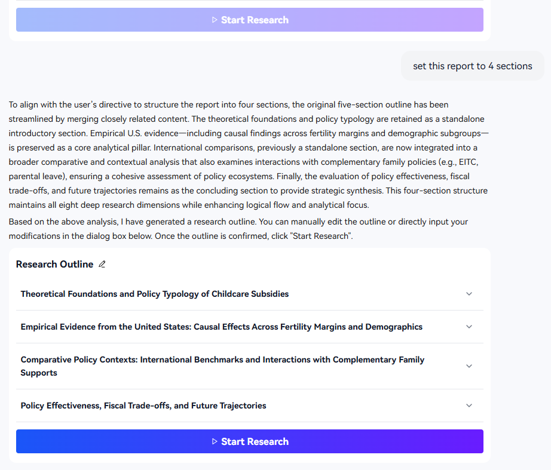
   - **Edit manually**: Click the edit button next to the outline title to directly modify titles, summaries, etc.
      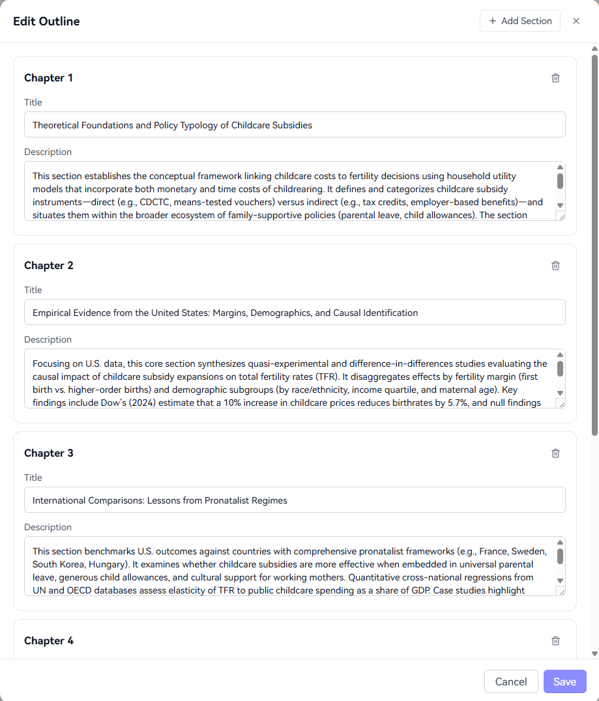
3. **Generate report**: You can revise the outline as many times as needed. Once satisfied, click **Start research** and DeepSearch begins writing the full report.

##### 2.1.2 Non-HITL mode

One turn: you ask → DeepResearch generates the report directly.

> Report generation behaves the same afterward; below uses non-HITL for the UI tour.

---
#### 2.2 Message panel

##### 2.2.1 Regions

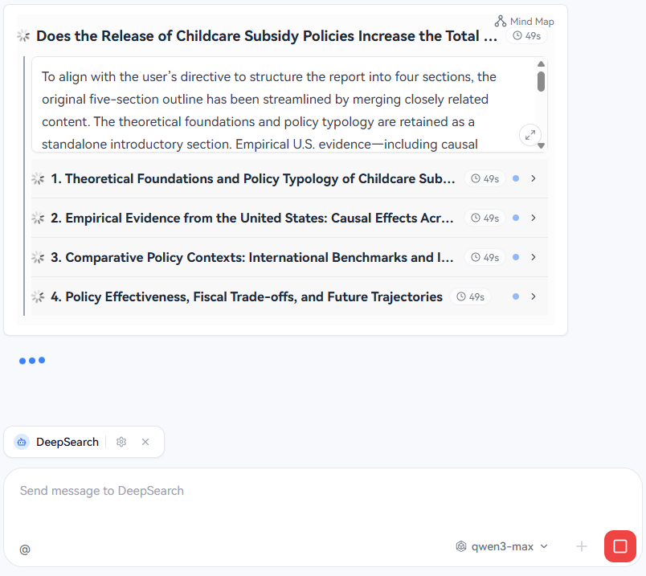

1. **1**: Your message.
2. **2**: Assistant message.
3. **3**: Step status: hollow gray = not started; spinner = running; green check = done; red = failed; yellow = stopped manually.
4. **4**: Current section title.
5. **5**: Section duration `d*h*m*s` (updates while running, fixed when done).
6. **6**: Expand/collapse body.
7. **7**: Sub-sections.
8. **8**: Expand/collapse sub-sections.
9. **9**: Thought chain link — click to open the thought chain graph in the right panel.

---
##### 2.2.2 Sub-section progress

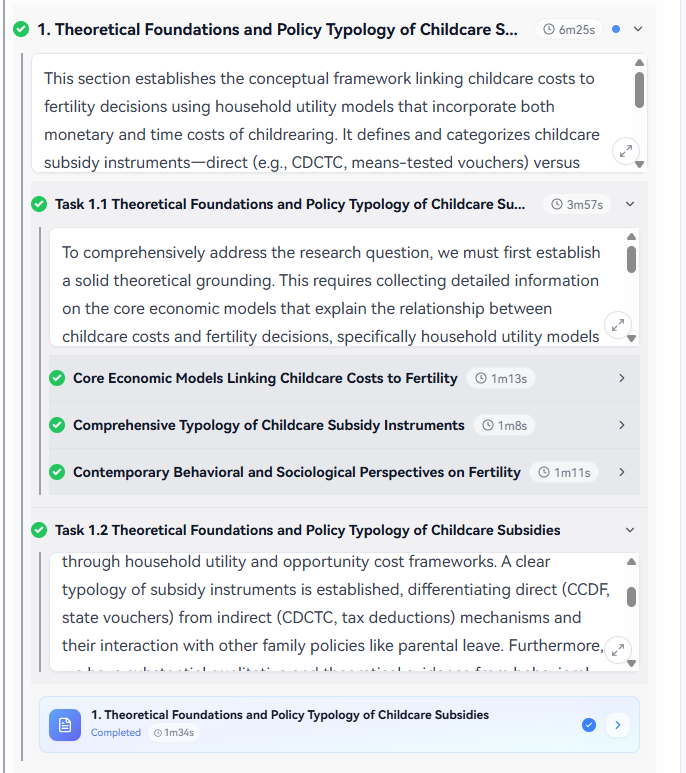

---
##### 2.2.3 External citations

Citations from web/local search.

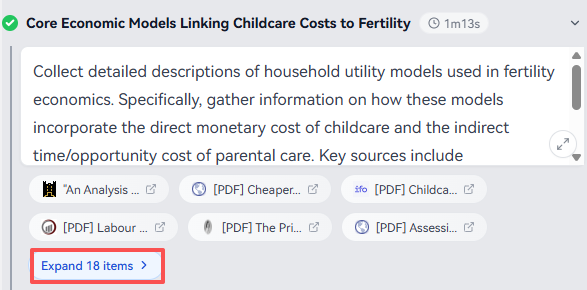 
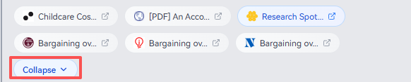

> Collapsed vs expanded via the toggle.

---
##### 2.2.4 Sub-report cards

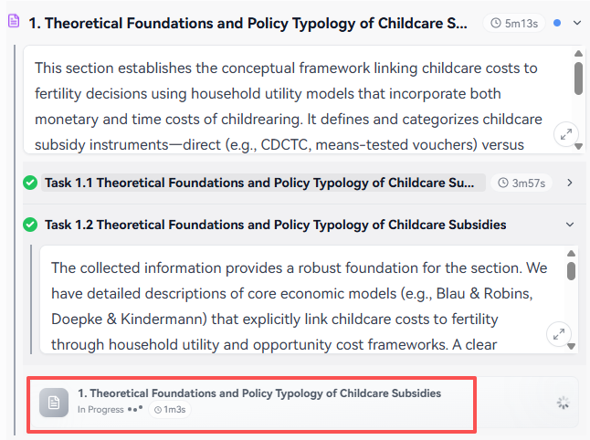 
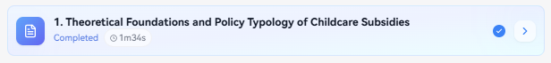

> **Generating**: gray, shows time, not clickable.  
> **Done**: blue, shows time, click to open the side panel.

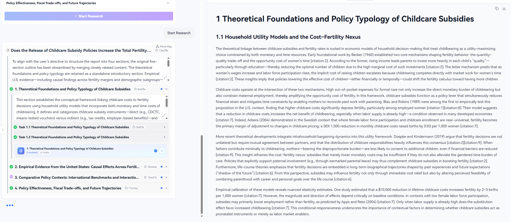

---
##### 2.2.5 Thought chain diagrams

Click the **thought chain link** (item **9** above) to open the right panel and view thought chain details. The graph updates in real time as research progresses.

Two graph types are available:

1. **Section graph**: Shows dependencies and execution order among all sections, giving a clear view of section progress and relationships.
2. **Task graph**: Shows detailed progress for each section and task, with specific task status and execution details.

###### 2.2.5.1 Section graph
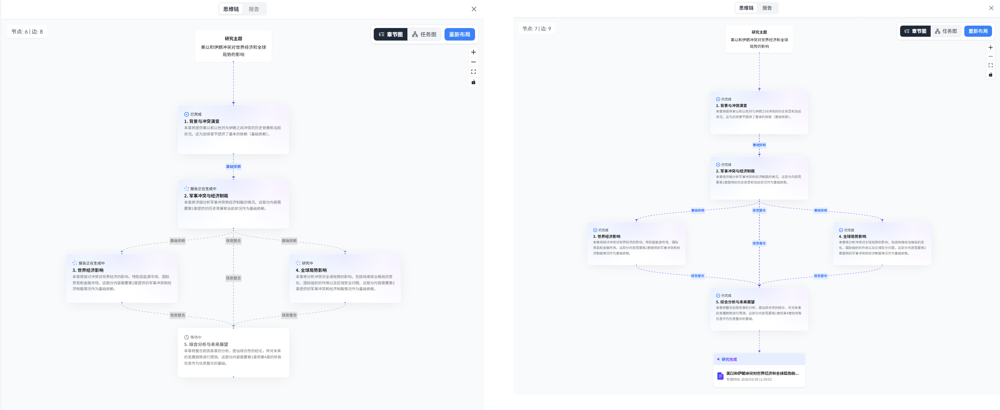 
> The left image shows the section graph while in progress; the right shows the completed state.

###### 2.2.5.2 Task graph
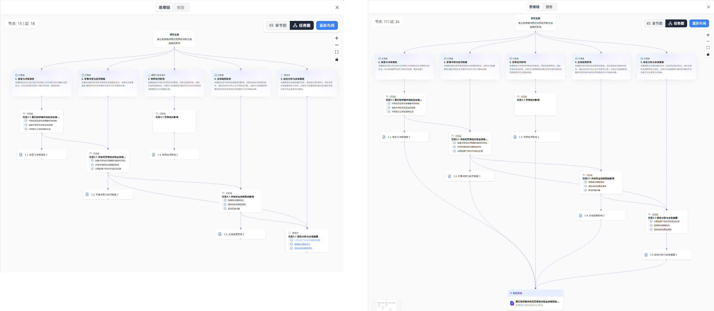 
> The left image shows the task graph while in progress; the right shows the completed state.

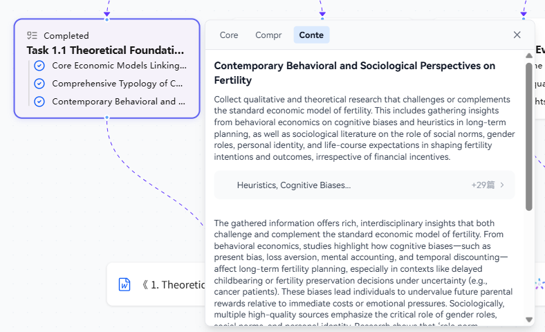
> Click a task node to expand task details — quickly review execution status, collected information, and summaries for each step.

###### 2.2.5.3 Report navigation
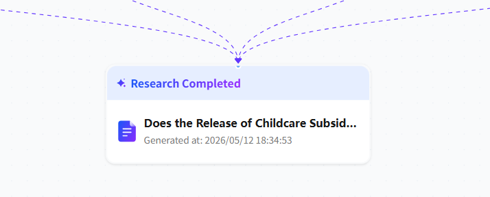
> Once a section or final report is complete, click the report node to navigate to it. The right panel will switch from the thought chain graph to the report view.

---
##### 2.2.6 Final report

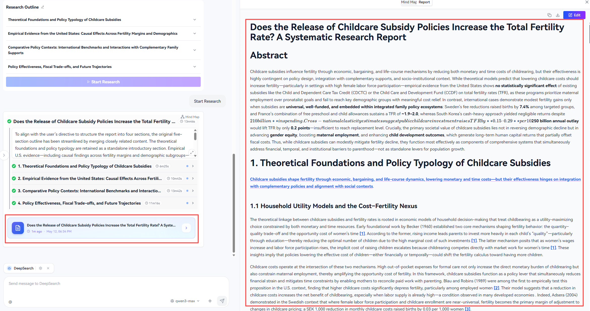

> Click the final report card to open details on the right.

---
#### 2.3 Conversation history

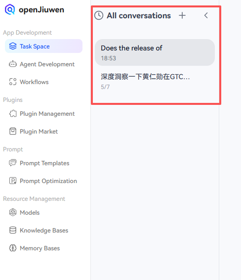

A **conversation** is a thread with context. In **All conversations** you can:

1. Collapse/expand the list.
2. Save a conversation.
3. Start a new one.
4. Open a past thread.
5. Delete a thread.

---
### 3. Final report

DeepSearch merges retrieved content into a report. A final report card appears in the UI.

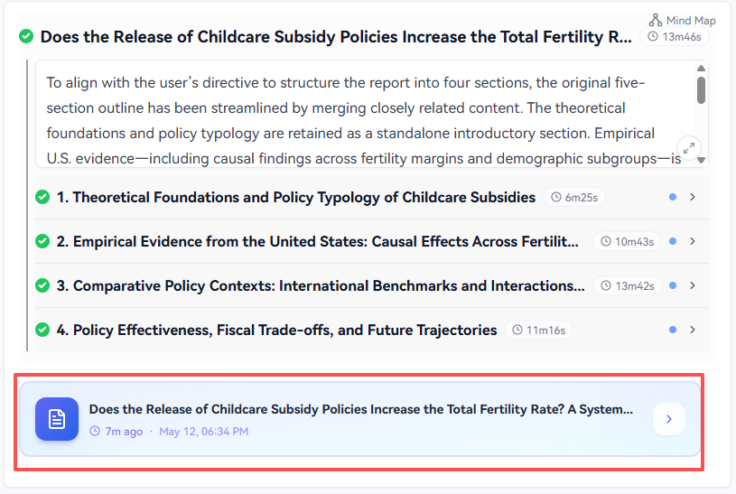

---
#### 3.1 Browse view

##### 3.1.1 Open / close full report

Click the card to toggle the detailed view.

Scroll to read.

---
##### 3.1.2 Citation details

Click numbered citations **[1]** for snippets, source, confidence, etc. Use **web** to open the source page.

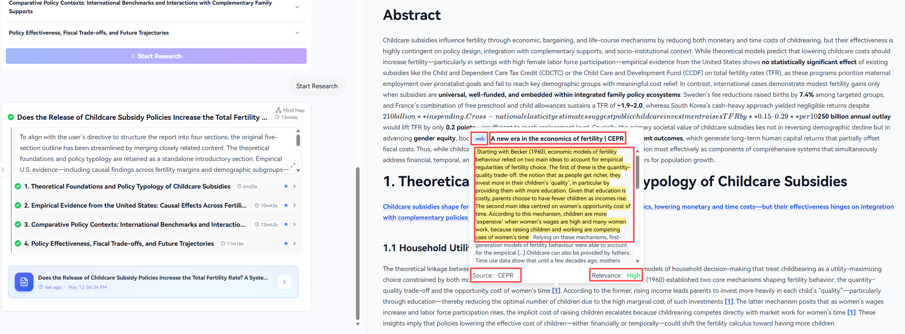

---
##### 3.1.3 Download

Use **Download** to save locally. 

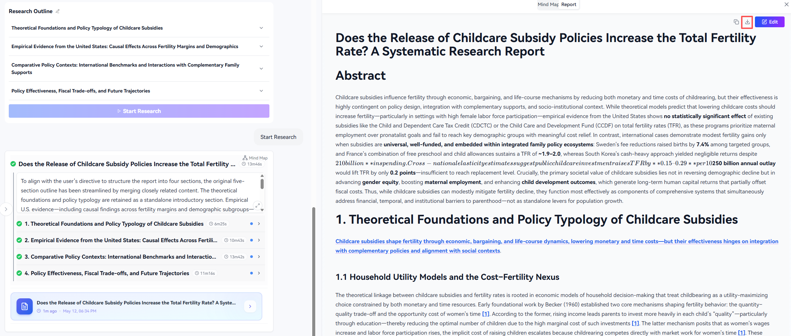

Supported formats: **Markdown**, **HTML**, **DOCX**.

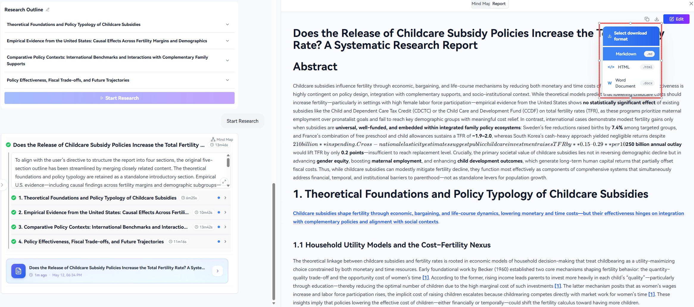

---
#### 3.2 Edit view

When **Enable user feedback optimization** is on, click the edit button to enter edit mode.

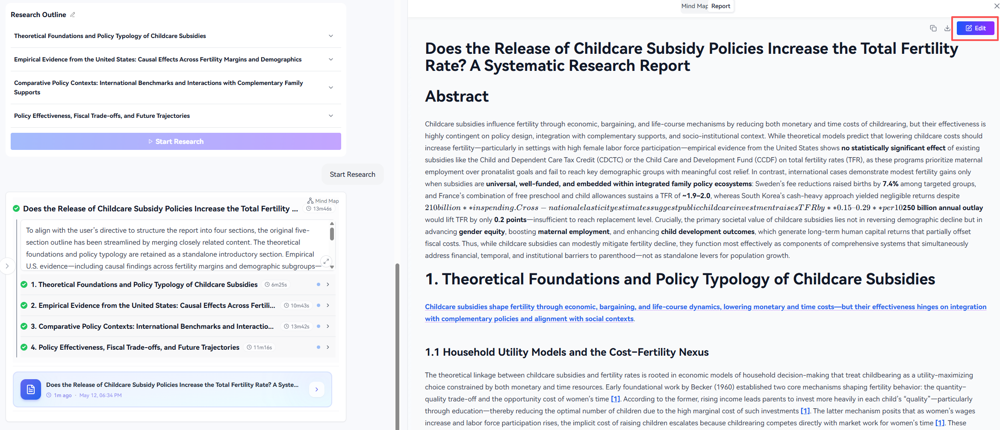

In edit mode, the following editing methods are available:
1. **Manual report editing**: Edit the report text directly. Changes can be synced manually or will auto-save within a few seconds. **Note**: After manual editing, always sync the report before using AI rewrite.
2. **AI rewrite**: The report is rendered as text blocks. Hover over a block to reveal the star sidebar button (AI rewrite) on the left. Hovering over the sidebar highlights the entire block.
3. **Truth Verification**: Verify the authenticity of selected paragraphs in the generated report.

##### 3.2.1 Manual report editing
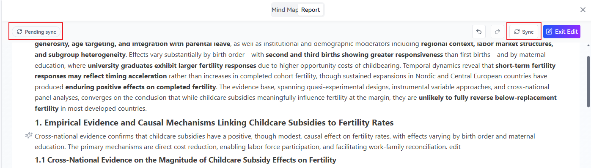
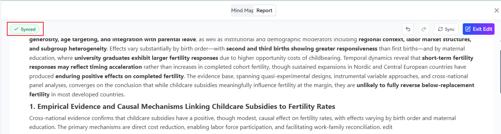
You can edit report text directly in the edit interface. While editing, a **Pending sync** indicator appears in the top-left of the report. After finishing, click **Sync** in the top-right to save, or wait 3 seconds for auto-save. On success, the indicator changes to **Synced**.

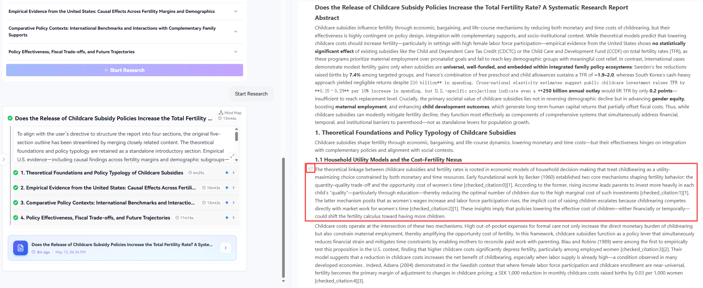

##### 3.2.2 AI rewrite
Click the AI rewrite button to open the rewrite input panel. Choose **Polish / Expand / Condense**, etc., enter your intent in the input box, then click send to trigger the model rewrite.

> Note: Selecting text or manually editing the report does not trigger AI rewriting. After manually editing the report, sync first, then use the sidebar for AI rewriting.

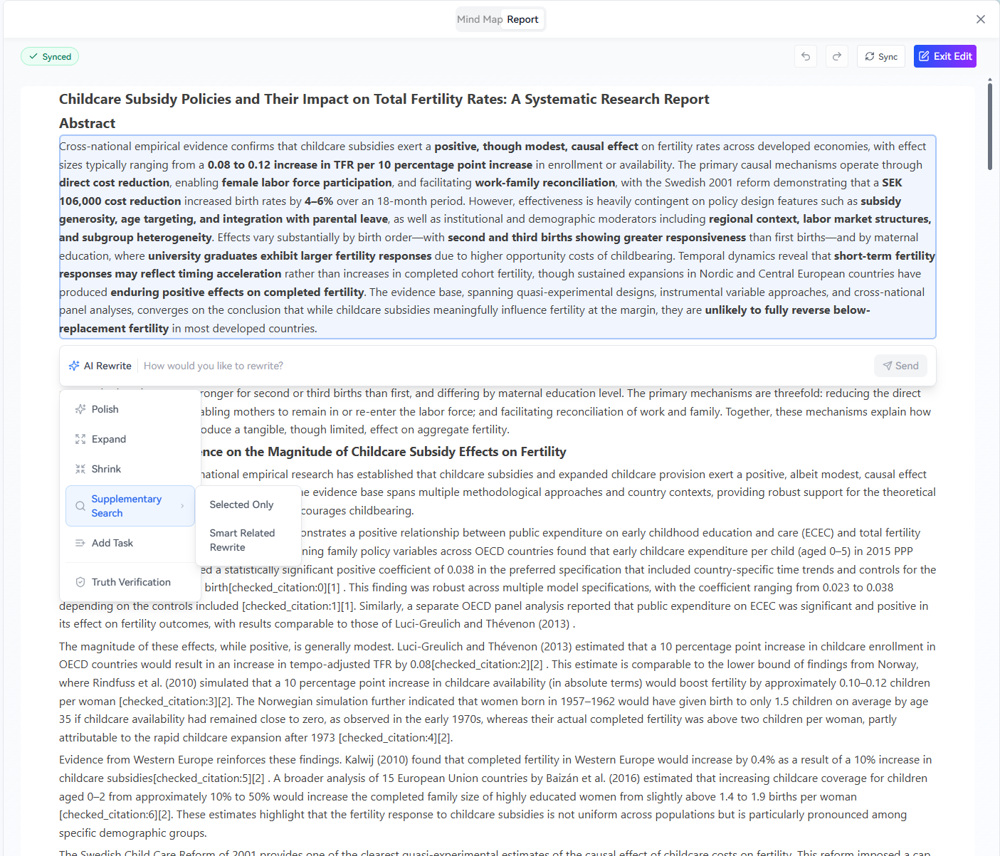

After rewriting, the action appears in the chat and a new report card is generated. The rewritten section is also updated in the report view. Supported rewrite operations:
* **Polish**: Improve readability and flow.
* **Expand**: Add more detail to the selected text.
* **Condense**: Make the selected text more concise.
* **Supplemental search**: Search for additional related information and incorporate it into the text. Two sub-modes:
  * **Selection only**: Rewrite only the selected text in-place without affecting other content.
  * **Smart linked rewrite**: Rewrite the entire minimum enclosing section, maintaining coherence.
* **Add Task**: Run an additional research task focused on the section containing the selected text and rewrite that section.

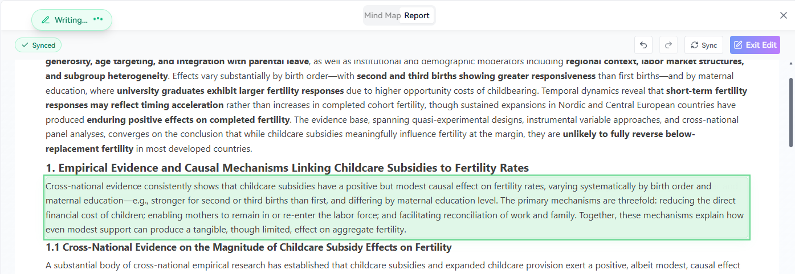
After a successful rewrite, the modified text is highlighted in light green so you can quickly locate the changes.

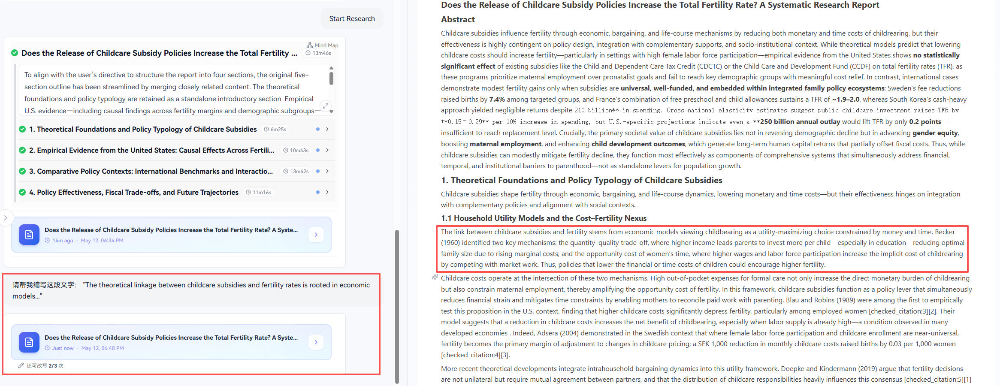

AI rewriting has a round limit. Plan your revisions accordingly — once the limit is reached, AI rewriting is no longer available for that report.

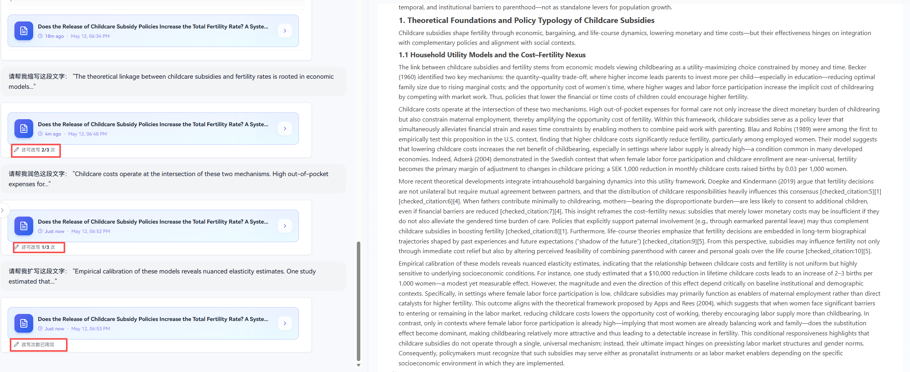

##### 3.2.3 Truth Verification
After a report is generated, you can select specific conclusions, data, or factual statements and request a fact-check to confirm whether the selected content is adequately supported by source material.

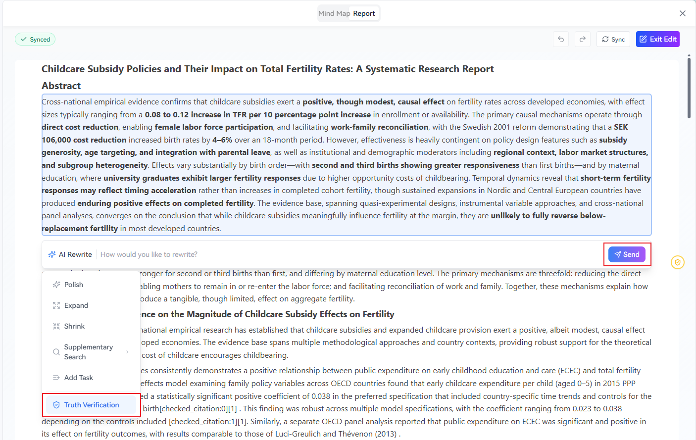

Select a paragraph in the generated report and trigger fact-checking. Once complete, a verification result badge appears to the right of the paragraph. Click the badge to view the result.

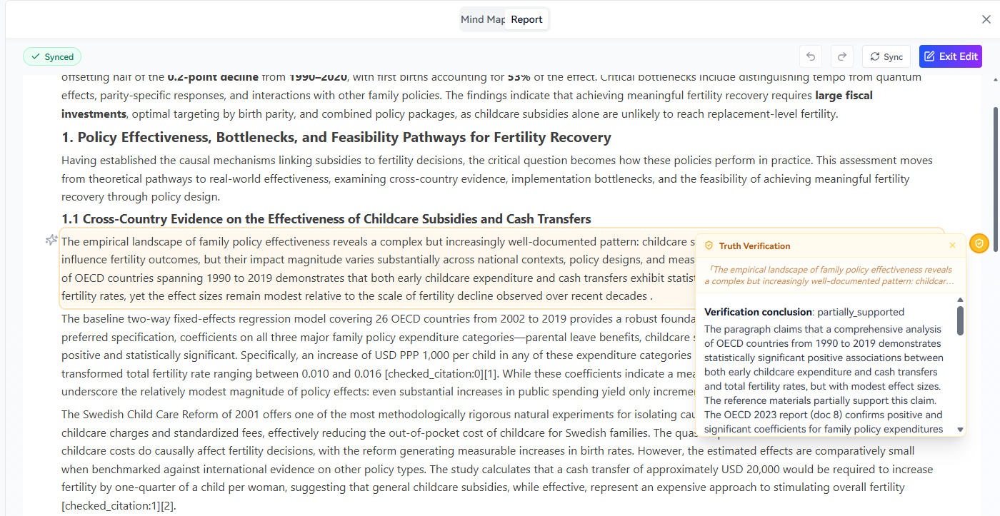

---

That completes the Deep Research walkthrough. For deeper topics, see the Developer Guide and hands-on tutorials.

---

## 3. Using the DeepSearch Agent

Deep Search mode is optimized for complex search tasks. To use the Deep Search mode in openJiuwen, follow these steps:

### 1. Select Deep Search mode

In **Task space**, select **Deep Search** mode.

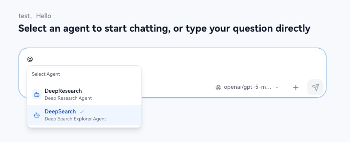

### Deep Search Configuration (steps 2 to 4)

#### 2. General settings

In **General** tab, configure search process settings such as question routing, actions explored limit and time limit.

**Question routing** saves LLM tokens by routing simple questions to a lightweight ReAct agent, and triggering Deep Search only for complex questions. 

**Actions explored limit** controls the maximum number of actions the agent can explore per question during the search process. It takes values between 1 and 200.

**Time limit** sets the maximum duration for the search process. It takes values between 1 and 3600 seconds.

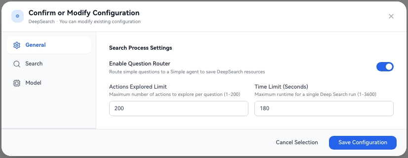

#### 3. Search settings

In the **Search** tab, select the source used by the search process. Deep Search supports two modes:

- **Online Enhancement**: use a configurable web search engine and a web fetch provider.
- **Local Search**: use a configured local knowledge bases.

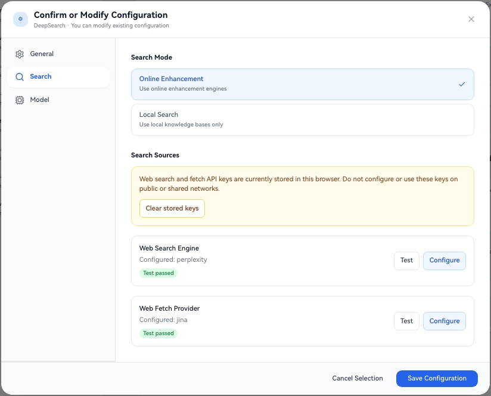

For **Online Enhancement**, click **Configure** under **Web Search Engine** to choose a provider. Multiple provider types are supported, including Xunfei Search, Petal AI Q&A, Tavily, Google, Jina, Serper, Bocha, Perplexity, and custom engines. Enter the provider API key, optional search URL, and any provider-specific extension parameters as JSON. This configuration is independent of web fetching, so the search provider can be changed without changing the fetch provider.

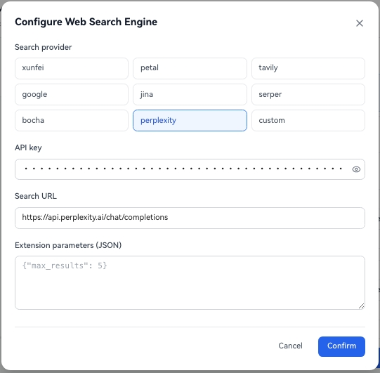

Click **Configure** under **Web Fetch Provider** to configure page retrieval separately. The current fetch-provider implementation supports **Jina**. Enter the Jina API key, optionally provide a base URL, and add provider-specific extension parameters as JSON.

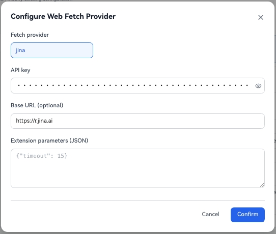

For **Local Search**, select **Local Search** and configure the local knowledge base to use.

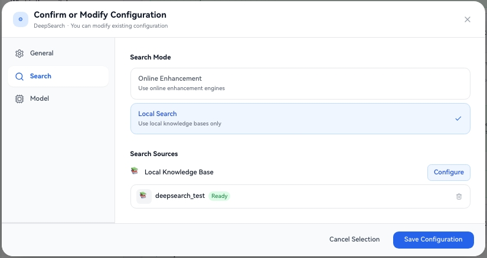

#### 4. Model settings

In **Model** tab, configure planning and search models. The **planning model** is used once at the beginning for question parsing, so a strong general-purpose model is recommended.

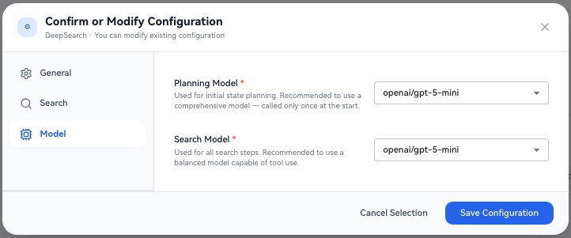

### 5. Enter a Deep Search question

Enter your Deep Search question in Task space and send it.

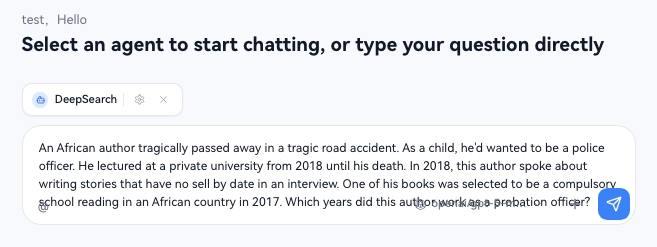

### 6. Search process starts

Deep Search begins the retrieval process and shows question-parsing outputs, including unknown entities to search and related statistics.

You can click **DeepSearch Explorer** for a more detailed view of the full Deep Search process.

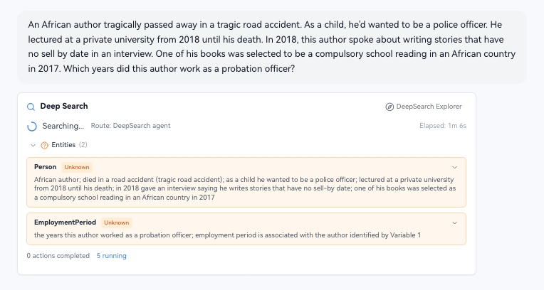

### 7. Get the answer

After the search process completes, the system displays the final answer.

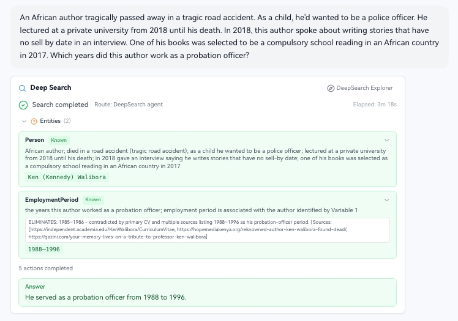
