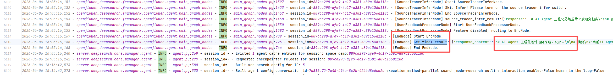

# FAQ

## 1. Installation issues

### 1. `uv python install` times out

**Error**

	Caused by: error decoding response body
	Caused by: request or response body error
	Caused by: operation timed out


**Fix**

① Mirror for standalone Python builds:

```sh
UV_PYTHON_INSTALL_MIRROR="https://registry.npmmirror.com/-/binary/python-build-standalone" uv python install
# or
uv python install --index https://registry.npmmirror.com/-/binary/python-build-standalone
```

Other mirrors:

```
https://python-standalone.org/mirror/astral-sh/python-build-standalone/
```

② Or raise HTTP timeout:

```sh
UV_HTTP_TIMEOUT=300 uv python install <version>
```

### 2. `uv` PyPI downloads time out

**Error**

	╰─▶ I/O operation failed during extraction
	╰─▶ Failed to download distribution due to network timeout. Try increasing UV_HTTP_TIMEOUT (current value: 30s).


**Fix**

```sh
UV_INDEX_URL=http://mirrors.aliyun.com/pypi/simple/ uv add <package>
```

### 3. `uv` SSL / unknown issuer (unusual domains)

**Error**

	Caused by: client error (Connect)
	Caused by: invalid peer certificate: UnknownIssuer


**Fix** (temporary; only if you understand the risk):

```sh
uv sync --allow-insecure-host github.com --allow-insecure-host pypi.org --allow-insecure-host files.pythonhosted.org
```

(`--trusted-host` may be used similarly depending on `uv` version.)

## 2. Logs

### Log location

openJiuwen-DeepSearch logs usually live under **`output/logs/common`** at the repo root. Two streams:

- **common_warning.log** — warnings and above (quick error scanning).
- **common.log** — general service logging.

Notes:

- `common.log` is mostly DeepSearch; third-party libs typically log only `warning`/`error` to disk (not `debug`/`info`).
- Very long lines may be truncated except for a few high-value outputs (citations, full reports, etc.).

### How to tell whether report generation succeeded and locate failures

When a workflow ends, the final output is written to `final_result` (see the [search_context reference](../4.Developer%20Guide/API%20Reference/search_context.md)). Start with **`exception_info`** and **`warning_info`**, then use **`conversation_id` / `thread_id`** in the logs to follow the full request.

| Field | Meaning |
|------|---------|
| `exception_info` | Error information that makes the workflow fail or the result unusable. Non-empty usually means failure. |
| `warning_info` | Non-fatal warnings, such as empty section collection or chart generation failure. A report may still be generated. |
| `response_content` | Report body. It should not be empty on success, except for partial rewrite scenarios. |

Decision priority: if `exception_info` is non-empty, treat the run as failed first. `warning_info` affects completeness assessment but does not change the success state by itself.

Errors use this format: `[error_code]error description: detail`, where `detail` is usually the original exception `e` or business detail. See [Appendix](#7-appendix) for shared error codes.

---

#### (1) If report generation succeeded, how to find the report

**① Check the API / SDK stream**

- In the final `final_result` pushed by `EndNode`, `exception_info` is an empty string `""`.
- The corresponding stream event is **`SUMMARY_RESPONSE`**. If `exception_info` is non-empty, the event is usually **`ERROR`**.
- A framework-level **`ALL END`** marker usually follows.
- `response_content` contains the Markdown report body.

**② Check logs, starting with `common_warning.log`**

1. Search by the task's **`conversation_id`** (the configured `thread_id`) to narrow the log range.
2. `common_warning.log` should not contain an `ERROR` that blocks the main workflow. A few `WARN` entries, such as model retries or a single empty search result, usually do not prevent the final report. If an `ERROR` appears in logs, still use `final_result.exception_info` as the final failure signal, and use the log to locate the cause.
3. In `common.log`, look for **`[EndNode] Start EndNode`** and **`Get final result`** with an empty `exception_info`.

4. Main-path nodes should have completion logs in order, for example: `EntryNode` -> `OutlineNode` / `OutlineInteractionNode` -> `EditorTeamNode` or `DependencyEditorTeamNode` -> `ReporterNode` -> `SourceTracerNode` -> `EndNode`. If provenance reasoning or user feedback is enabled, extra nodes may appear in between.

**③ Warnings can still mean success**

- If `warning_info` is non-empty and `exception_info` is empty, a report may have been generated, but some sections, charts, or collection steps may have issues. Evaluate completeness based on the warning content.
- If the business requires "zero warnings", check that both `exception_info` and `warning_info` are empty.

**④ Optional node debug logs**

- After enabling `node_debug_enable`, check **`output/logs/common/node_debug_log/`** for node input/output snapshots. These are useful for inspecting outlines, section plans, and sub-reports.

**⑤ Quick report lookup**

- In **`common.log`**, filter by `conversation_id` / `thread_id`, then search for **`Get final result`**.
- In the matching log entry, `final_result.response_content` is the final report body. Also confirm that `exception_info` is empty so partial content from a failed run is not mistaken for a complete report.

---

#### (2) If generation failed, how to locate the issue

**① Confirm the failure signal**

**Log side: check the final result**

- In **`common.log`**, search for **`Get final result`** and check `final_result.exception_info`.
- A non-empty `exception_info` means the workflow ended with an error. Even if `response_content` has content, do not treat it as a complete success.
- If only `warning_info` is non-empty, the run usually completed with degradation and needs manual quality assessment.

**API side: check return events / HTTP response**

- `EndNode` or the framework layer pushes **`event: ERROR`**, and `content` usually contains `exception_info`.
- If the workflow crashes outside the `run` call, the HTTP response may directly contain `{"exception_info": "..."}`.

**② Use the error code to locate the module / node**

- The leading **`[211800]`**-style value in `exception_info` is the error code. Use [status_code.py](https://gitcode.com/openJiuwen/deepsearch/blob/dev/openjiuwen_deepsearch/common/status_code.py) to locate the related module or node.
- The text after the colon is the concrete reason, usually an exception message or business detail. Use it as a keyword for deeper log searches.

Common error code ranges:

| Error code range | Typical node / phase |
|------------------|----------------------|
| 211600 | `EntryNode` language routing / intent detection |
| 211700-211702 | `GenerateQuestionsNode` / `FeedbackHandlerNode` HITL interaction |
| 211800 | `OutlineNode` outline generation |
| 211801 | Subgraph `PlanReasoningNode` task planning |
| 211901 | Empty section information collection |
| 212000 | Sub-report generation |
| 212001 | Final report `ReporterNode` |
| 212106 / 212300 | Source tracing / provenance reasoning |

**③ Search logs by `conversation_id` / `thread_id`**

1. Open **`common_warning.log`** and filter by `conversation_id` / `thread_id`.
2. Search for **`ERROR`** and note the nearby node name, such as `[OutlineNode]`, `[ReporterNode]`, `[EditorTeamNode]`, `plan_reasoning`, or `sub_reporter`.
3. If `exception_info` contains a concrete exception message, search the same keyword in **`common.log`** to find the full stack and surrounding context.
4. Use **3.3 Which nodes matter** to decide whether the issue is local to one section or breaks the full report.

**④ Drill down through subgraph / main graph**

- A subgraph error for a single section is first written to `section_context.exception_infos`, then summarized by `EditorTeamNode` into the main graph's `final_result.exception_info`.
- If logs include section-level `section_idx` / `plan_idx`, continue tracing the corresponding Planner, InfoCollector, and SubReporter logs.

**⑤ Recommended order**

```
final_result.exception_info  ->  error code table  ->  common_warning.log filtered by thread_id
->  node name  ->  common.log exception details  ->  optional node_debug_log intermediate outputs
```

## 3. Model errors

### 3.1 Call failures / timeouts

Messages mentioning **stream error**, **timeout**, **OpenAI API**, or **Client connection error** usually mean the LLM call failed—network issues, bad endpoint, context overflow, or provider safety filters.


If logs show `LLM wall-clock timeout after ...`, that is the outer business-layer timeout from `agent_llm_timeouts`, not the same thing as the underlying `service_config.llm_timeout`. In that case, check whether `agent_llm_timeouts` includes `default`, whether the matched rule is too small, or whether a rule was unintentionally set to `0`.

### 3.2 “Retry” / format non-compliance

**retry** in logs often indicates the model output failed validation; DeepSearch retries internally until it errors out (or stays at WARN).

### 3.3 Which nodes matter

Some retries are benign; others affect report quality:

**Higher impact** (may break structure or sections):

```
entry — whether reporting runs at all
outliner — full outline
planner — per-section plan (affects that section)
sub_reportor — subsection body
reportor — final assembly
```

**Lower impact** (local to one search iteration):

```
summary — single search summary
reflection — search depth for one loop
citation verify — provenance for one hit
```

### 3.4 Models must support tool / function calling

DeepSearch relies heavily on **function calling**. Models without that capability cannot drive the workflow end-to-end.

## 4. Web search / augmentation errors

### 4.1 Engine HTTP failures

`ERROR` lines such as **Search request failed** mean the configured engine is unreachable or misconfigured. Empty large “gathering” panels in the UI often mean the same.

### 4.2 Empty `search_results`

Search logs for **`TOOL END`**: check engine type and whether `search_results` is empty for the query.

- Always empty → engine/config outage.
- Empty only sometimes → transient engine issues.
- Sparse empty rows → likely no hits for that query (usually harmless).

## 5. Knowledge base / local search

### 5.1 Cannot create KB / connect to Milvus

Likely **`MILVUS_HOST` / `MILVUS_PORT`** wrong or Milvus not running.

Set them in `.env` to match your Milvus endpoint (default often `localhost:19530`).

### 5.2 `run` fails token validation

Error like `Input should be a valid string ... vector_store.token` when value is `None`.

If **`MILVUS_TOKEN`** is unset, `None` may be passed while the schema expects a string.

Set `MILVUS_TOKEN` in `.env` (empty string if Milvus has no auth—the service normalizes empty to a string).

### 5.3 Index build fails with SSL errors

Embedding over HTTPS may fail if `EMBEDDING_SSL_VERIFY` / `EMBEDDING_SSL_CERT` disagree with the server cert (self-signed, private CA, etc.).

Adjust `.env` (see `.env.example`):

- Skip server cert check: `EMBEDDING_SSL_VERIFY=false` or leave blank (this repo’s `server/main.py` treats blank as off).
- Public CA: `EMBEDDING_SSL_VERIFY=true`, `EMBEDDING_SSL_CERT` empty.
- Private CA: `EMBEDDING_SSL_VERIFY=true` and `EMBEDDING_SSL_CERT=<path-to-pem>`.

## 6. Service / API behavior

### 6.1 Deployment constraints

DeepSearch supports distributed deployment but **one process per machine** unless you adopt Redis checkpointer mode. Multiple instances on one host should use **`CHECKPOINTER_TYPE=redis`**.

With Redis checkpointer, **`DB_TYPE` must be `mysql`** and every instance must share the **same** MySQL (metadata lives in the app DB). Pairing `redis` with `sqlite` fails validation at startup.

Distributed mode also requires full object storage settings (`OBS_SERVER`, `OBS_BUCKET`, `OBS_REGION`, `OBS_ACCESS_KEY_ID`, `OBS_SECRET_ACCESS_KEY`); see installation docs. `in_memory` / `persistence` keep KB uploads on local disk—even if `OBS_*` exist, they are not used for KB files in those modes.

### 6.2 `conversation_id` rules

Except within a single task’s interrupt/resume flow, each SDK `run` should use a **new** `conversation_id`.

**Reuse** the same `conversation_id` only when:

- Resuming HITL clarification.
- Resuming outline interaction.
- Continuing post-report local editing after the report is done.

### 6.3 `space_id` vs local KB

For HTTP `run`, `space_id` defines the tenant/workspace boundary. Every KB id in `local_search_config.local_search_config_ids` must be registered under that `space_id` on the server; otherwise access is denied.

`DeepSearchAgentManager` caches agents using a hash of all fields that affect construction (excluding `message`, `conversation_id`, `interrupt_feedback`), including **`space_id`**, **`local_search_config`**, web search settings, `llm_config`, and switches—so changing KB or engine config under the same space also yields a fresh agent instance.

> `space_id` comes from the client; bind it to authenticated identity at the gateway.

## 7. Appendix

Shared error codes and node status definitions: [status_code.py](https://gitcode.com/openJiuwen/deepsearch/blob/dev/openjiuwen_deepsearch/common/status_code.py)

### macOS: `No module named 'greenlet'`

If `uv run start_backend.py` fails with missing **greenlet**, install it into the same environment, e.g. `uv pip install greenlet`, or add it to your dependency group and run `uv sync` again.
